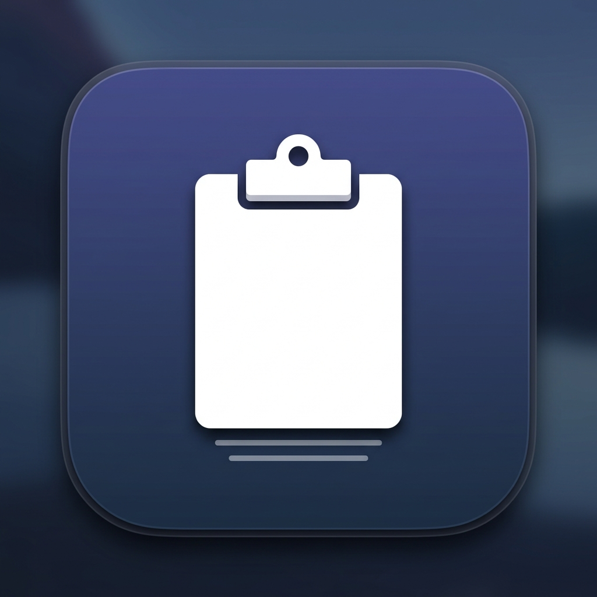

# Clipper

> Lightweight macOS clipboard manager. Lives in the menu bar, surfaces with `⌘⇧C`, pastes with a click.

[](https://github.com/Vatsal057/Clipper/releases)
[](LICENSE)
[](https://github.com/Vatsal057/Clipper)

macOS already has a clipboard, but it only remembers the last thing you copied. Clipper watches your clipboard in the background, keeps a scrollable history, and pastes any previous entry back into whatever app you were using — without leaving your keyboard.

No Electron, no background daemons, no telemetry. ~600 lines of native Swift + SwiftUI.



## Features

- **Instant recall** — `⌘⇧C` opens a compact history panel right at your cursor
- **Click to paste** — select any item; Clipper puts focus back on the previous app and sends `⌘V`
- **Text and images** — both captured automatically as you copy
- **Source context** — each entry shows the app icon, app name, and relative timestamp
- **Live search** — start typing to filter; `Esc` or click-outside closes
- **Pin** — hover an item and pin it; pinned entries survive restarts
- **Privacy by default** — unpinned history is in-memory only; nothing written to disk between sessions
- **Max 100 items** — oldest unpinned entries auto-evict; no unbounded growth
- **No Dock icon** — runs as a macOS menu-bar agent (`LSUIElement`)

## Install

Download `Clipper.dmg` from the [latest release](https://github.com/Vatsal057/Clipper/releases/latest), open it, drag Clipper to Applications.

First launch: macOS will ask for **Accessibility access** — required once so Clipper can send `⌘V` to other apps.

> **Gatekeeper note:** The app is signed with an Apple Development certificate but not notarized. On first open, go to System Settings → Privacy & Security → Open Anyway. After that, it opens normally.

## Build from source

Requirements: macOS 14+, Xcode Command Line Tools, Ruby (ships with macOS).

```bash
git clone https://github.com/Vatsal057/Clipper
cd Clipper
gem install xcodeproj   # one-time
./build.sh              # builds and launches
```

To produce a distributable DMG:

```bash
./build.sh dist         # → dist/Clipper.dmg
```

## Usage

| Action | How |
|--------|-----|
| Toggle clipboard history | `⌘⇧C` (anywhere) or click menu bar icon |
| Paste an item | Click it — focus returns to your previous app |
| Search | Just type in the panel |
| Pin / unpin an item | Hover → click the pin icon |
| Delete an item | Hover → click the trash icon |
| Clear all unpinned | Footer → Clear (with confirmation) |

## How it works

Clipper polls `NSPasteboard.general.changeCount` every 0.5 s. On a change it reads the content and the frontmost app's name and icon, then prepends a `ClipboardItem` to an in-memory `@Observable` store.

`⌘⇧C` is caught by a `CGEventTap`. When triggered, the panel opens in an `NSPanel` at `.popUpMenu` level, positioned at the mouse cursor. Selecting an item writes the content back to the pasteboard and posts a `CGEvent` `⌘V` to the previously-focused app.

## Roadmap

- [x] Menu-bar history with click-to-paste
- [x] Cursor-positioned hotkey panel
- [x] Search, pin, delete, clear
- [ ] Configurable hotkey
- [ ] Plain-text stripping (paste without formatting)
- [ ] Configurable history limit

## Troubleshooting

**`⌘⇧C` does nothing**
Grant Accessibility: System Settings → Privacy & Security → Accessibility → Clipper → ON. Restart Clipper.

**Items not appearing**
The pasteboard watcher starts 0.5 s after launch. Copy something and check the panel.

**Gatekeeper blocks the app**
System Settings → Privacy & Security → Open Anyway, or: `xattr -cr /Applications/Clipper.app`

## License

[MIT](LICENSE) © 2026 Vatsal Vaghasiya
